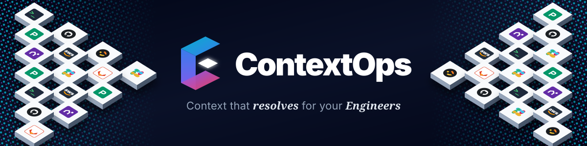
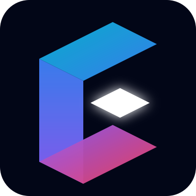
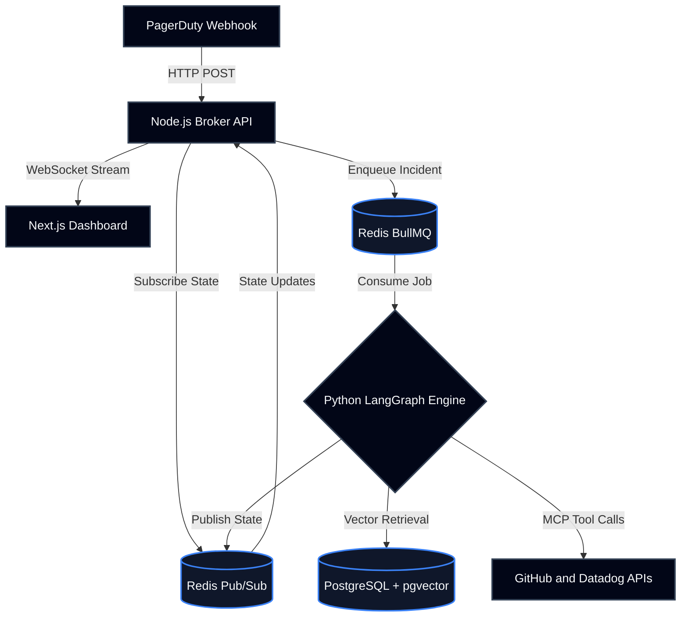

<p align="center">
  
</p>

<p align="center">
  
  
  
  
  
  
  
</p>

---

## Overview

ContextOps is an automated incident response engine. It fetches infrastructure context across monitoring tools, evaluates telemetry data using LangGraph and Model Context Protocol (MCP) integrations, and provides validated resolution protocols via Retrieval-Augmented Generation (RAG).

<p align="center">
  <video autoplay loop muted playsinline controls width="100%">
    <source src="docs/assets/project.mp4" type="video/mp4">
  </video>
</p>

## Core Capabilities

- **Stateful Triaging**: Implements continuous event loops using LangGraph to analyze complex telemetry spanning multiple decoupled systems.
- **Vector-Grounded Resolution**: Executes cosine-similarity searches via `pgvector` to anchor mitigation strategies in organizational runbooks, eliminating hallucination.
- **Real-Time Streaming**: Broadcasts state mutations and resolution vectors instantaneously via WebSocket and Redis Pub/Sub directly to the client interface.
- **Extensible Integration**: Interfaces with existing monitoring infrastructure (PagerDuty, Datadog) through the standardized Model Context Protocol (MCP).

## Context Fragmentation

During critical outages, engineering telemetry is distributed across decoupled systems (PagerDuty, Datadog, Grafana, GitHub). This state, defined as context fragmentation, increases Mean Time to Resolution (MTTR).

| Manual Triaging | ContextOps Engine |
| :--- | :--- |
| **T+00:00** - PagerDuty alert initiates incident. | **T+00:00** - PagerDuty webhook initiates ContextOps pipeline. |
| **T+05:00** - Engineer parses Datadog logs manually. | **T+00:02** - MCP integrations fetch telemetry and recent PRs. |
| **T+15:00** - Engineer queries internal wiki for runbooks. | **T+00:05** - RAG pipeline retrieves vector-matched runbooks. |
| **T+30:00** - Engineer executes mitigation protocol. | **T+00:08** - Actionable context streamed to dashboard. |

## Intelligence Layer



The execution environment utilizes state-of-the-art agentic frameworks to enforce deterministic operational protocols:

- **LangChain**: Provides the foundational interface for LLM communication, structuring prompts, and parsing complex JSON telemetry payloads.
- **LangGraph**: Orchestrates the cyclic, stateful reasoning loop. It acts as the cognitive traffic controller, dynamically deciding whether to execute further Model Context Protocol (MCP) tool calls (e.g., fetching additional GitHub commits) or synthesize a final mitigation strategy.
- **Retrieval-Augmented Generation (RAG)**: Grounds the agent in proprietary organizational data. The system embeds incident error traces and performs cosine-similarity vector searches against a PostgreSQL (`pgvector`) database containing the organization's historical runbooks.

## System Architecture

The platform operates on a decoupled event-driven architecture, separating the client state, message broker, and AI execution layers.



## Local Environment Configuration

Execute the following commands to initialize the required services.

### 1. Provision Infrastructure

Initialize the Redis and PostgreSQL containers.

```bash
docker compose up -d
```

### 2. Configure Knowledge Base

Install dependencies and compute embeddings for the proprietary runbooks.

```bash
cd ai-engine
pip install -r requirements.txt
python ingest_runbooks.py
```

### 3. Initialize Execution Layer

Start the Python worker process.

```bash
cd ai-engine
python worker.py
```

### 4. Initialize Broker Layer

Start the Node.js API server.

```bash
cd core-api
npm install
npm run dev
```

### 5. Initialize Frontend Client

Start the Next.js development server.

```bash
cd dashboard
npm install
npm run dev
```

Access the client interface at `http://localhost:3000`. Authenticate via the configured Clerk instance.

## Contributing

Engineering contributions are accepted via Pull Requests. Ensure all code passes formatting and linting checks prior to submission. Refer to `CONTRIBUTING.md` for architectural constraints.

## License

ContextOps is distributed under the MIT License. Refer to `LICENSE` for complete terms and conditions.
